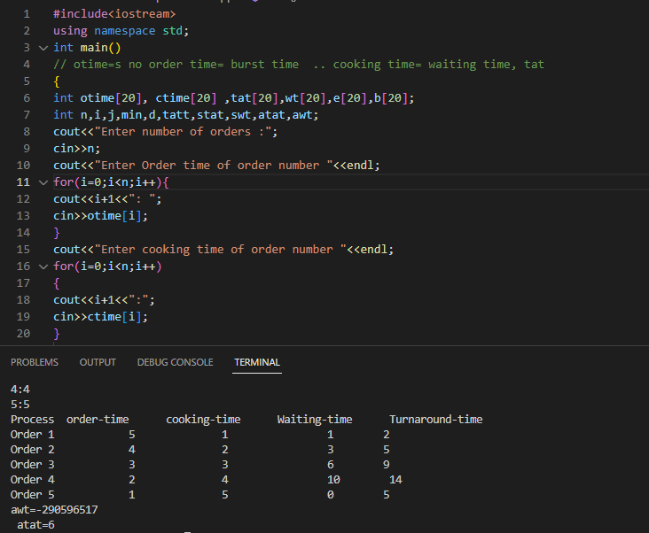

<body>
    <h1>Shortest Job First with food ordering system</h1>
    
This c++ code contains Shortest Job First(SJF) modified with respect to a food ordering sytem.
        The system demands priorties by managing orders in queue based on distance of customer, that is why
        SJF is selected. The arrival time and burst time is sorted by Selection sort, and all the otger values
        are calculated by formula
    

    
</body>
</html>
